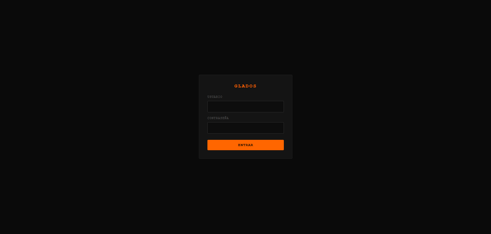
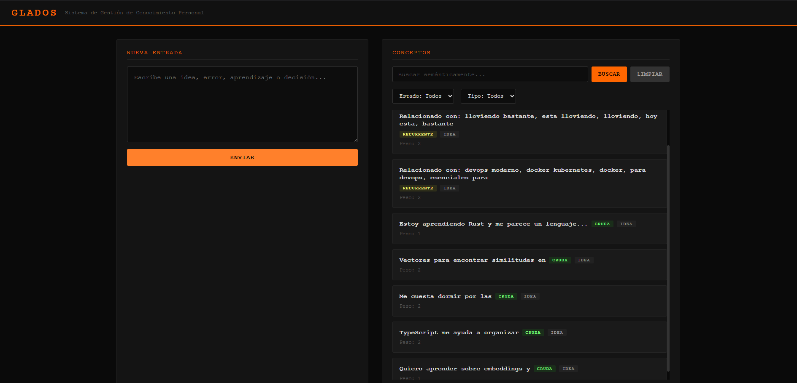
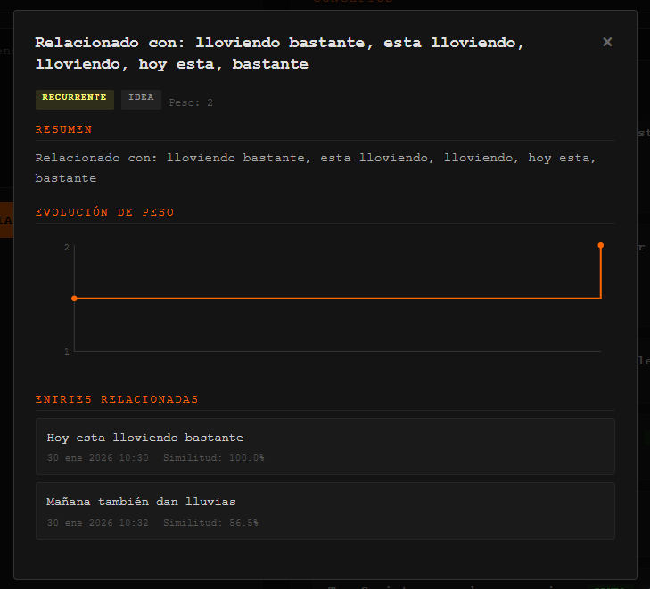

# GLaDOS - Personal Knowledge Management System

A system that captures free-form text (ideas, errors, learnings, decisions), generates dual embeddings, and organizes knowledge into concepts that automatically evolve based on recurrence.

## Screenshots

| Login | Main View |
|:---:|:---:|
|  |  |

| Concept Detail |
|:---:|
|  |

## Features

- **Dual embeddings** - MiniLM (384-dim) for sentence similarity + MPNet (768-dim) for semantic similarity
- **Zero-shot classification** - Concept type detection using mDeBERTa (multilingual NLI) instead of fragile regex patterns
- **Evolving concepts** - Concepts automatically change state: `raw → recurring → important → dormant → resolved`
- **Semantic search** - Find related concepts using cosine similarity with pgvector
- **Auto-extraction** - Keywords and summaries generated with KeyBERT
- **Manual corrections** - Reassign, unlink, or create new concepts from entries when the model gets it wrong
- **PWA** - Web interface with offline support and JWT authentication

## Tech Stack

| Layer | Technologies |
|-------|-------------|
| **Backend** | Express 4, TypeScript 5, pg 8 |
| **AI Service** | FastAPI, Sentence Transformers, KeyBERT, Transformers (mDeBERTa) |
| **Database** | PostgreSQL 16 + pgvector (IVFFlat) |
| **Infrastructure** | Docker Compose |

## Architecture

```
┌─────────────┐     ┌─────────────┐     ┌─────────────┐
│   PWA       │────▶│   Express   │────▶│  PostgreSQL │
│  (Frontend) │     │  (Backend)  │     │  + pgvector │
└─────────────┘     └──────┬──────┘     └─────────────┘
                           │
                           ▼
                    ┌──────────────┐
                    │   FastAPI    │
                    │  Embeddings  │
                    │  + mDeBERTa  │
                    └──────────────┘
```

**Main flow:**
1. User sends text via `POST /api/entries`
2. Backend requests dual embeddings from the AI service
3. Searches for similar concepts using cosine similarity (threshold 0.55)
4. If match found → reinforces the existing concept
5. If no match → creates a new concept with summary and keywords

## Getting Started

### Prerequisites

- Docker and Docker Compose
- (Optional) Node.js 18+ for local development

### Setup

1. Clone the repository:
```bash
git clone https://github.com/abraham-diaz/GLaDos.git
cd GLaDos
```

2. Create the environment variables file:
```bash
cp .env.example .env
```

3. Configure the variables in `.env`:
```env
# Database
POSTGRES_USER=glados
POSTGRES_PASSWORD=your-secure-password
POSTGRES_DB=glados

# Authentication
AUTH_USERNAME=admin
AUTH_PASSWORD=your-secure-password
JWT_SECRET=your-random-secret-key
JWT_EXPIRES_IN=90d
```

4. Start the services:
```bash
docker-compose up --build
```

5. Access the application at `http://localhost:3000`

### Local Development

```bash
# Backend (requires DB and AI service running)
cd backend && npm install && npm run dev

# AI Service
cd ai-service && pip install -r requirements.txt && uvicorn main:app --reload
```

## API Endpoints

| Route | Method | Auth | Description |
|-------|--------|------|-------------|
| `/health` | GET | No | Health check (DB + AI service) |
| `/api/auth/login` | POST | No | Login, returns JWT |
| `/api/auth/verify` | GET | Yes | Verify valid token |
| `/api/entries` | POST | Yes | Create new entry |
| `/api/entries/:id/concept` | PUT | Yes | Reassign/create/unlink entry from concept |
| `/api/concepts` | GET | Yes | List concepts |
| `/api/concepts/:id` | GET | Yes | Concept detail with linked entries |
| `/api/concepts/:id` | DELETE | Yes | Delete concept |
| `/api/concepts/search` | POST | Yes | Semantic concept search |
| `/api/concepts/reclassify` | POST | Yes | Reclassify all concepts |

### Manual entry management (`PUT /api/entries/:id/concept`)

Allows correcting incorrect model associations:

- `{ "conceptId": "uuid" }` → Reassign entry to another existing concept
- `{ "action": "create" }` → Create a new concept from the entry
- `{ "action": "unlink" }` → Unlink entry (leave it without a concept)

## Data Model

```sql
entries          -- User text + sentence embedding
concepts         -- Extracted knowledge with dual embeddings, weight, and state
entry_concept    -- N:N relationship with similarity score
signals          -- Metadata (emotion, repetition, intention, clarity)
weekly_summaries -- Aggregated weekly summaries
```

### Concept States

| State | Description |
|-------|-------------|
| `raw` | Newly created concept |
| `recurring` | Weight >= 2, appears frequently |
| `important` | Manually marked as important |
| `dormant` | No recent activity |
| `resolved` | Closed/completed concept |

### Concept Types

Classified automatically using zero-shot NLI (`mDeBERTa-v3-base-mnli-xnli`):

| Type | Description |
|------|-------------|
| `idea` | Proposals, suggestions, things to explore |
| `error` | Bugs, failures, technical problems |
| `aprendizaje` | New concepts learned, personal discoveries |
| `decision` | Firm choices about tools, approaches, or strategies |

## Project Structure

```
GLaDos/
├── backend/                 # Node.js + Express + TypeScript
│   ├── src/
│   │   ├── config/         # Environment variables
│   │   ├── services/       # Business logic
│   │   ├── routes/         # REST endpoints
│   │   ├── queries/        # Parameterized SQL
│   │   └── types/          # TypeScript interfaces
│   └── public/             # PWA frontend
├── ai-service/             # Python + FastAPI
│   └── main.py             # Embeddings + KeyBERT + zero-shot classification
├── db/
│   └── init.sql            # Schema with pgvector
└── docker-compose.yml
```

## License

MIT
