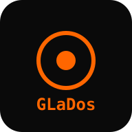
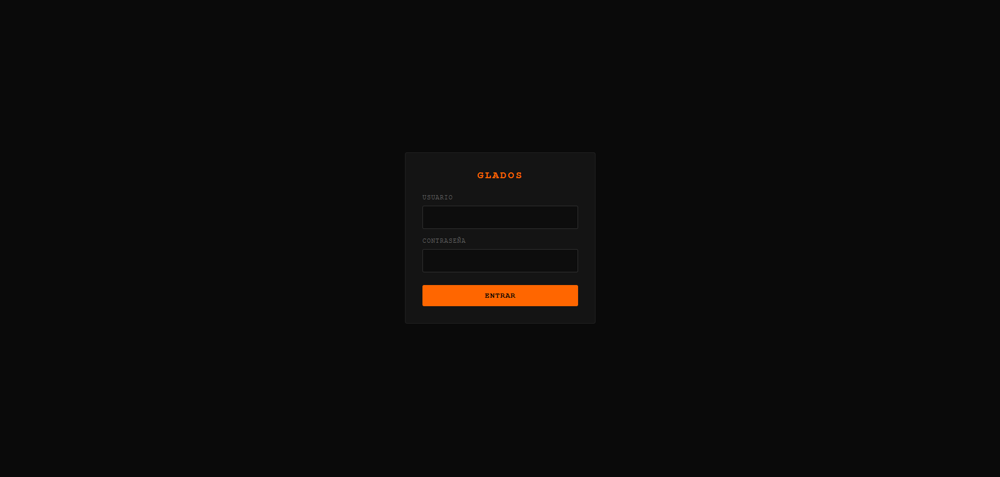
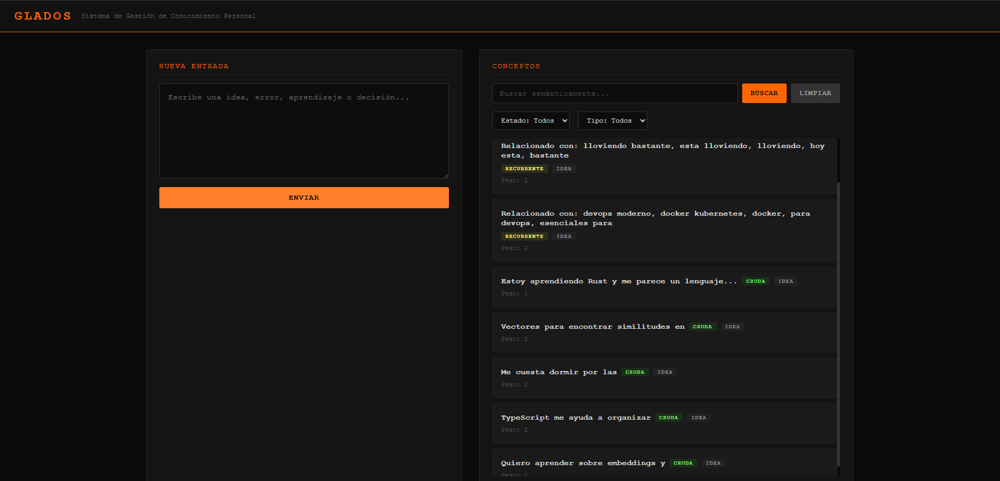
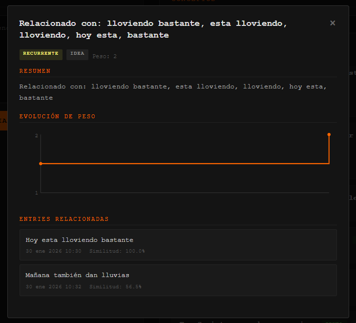

<div align="center">


# GLaDOS

### Personal Knowledge Management System

      

</div>

---

## What is GLaDOS?

GLaDOS captures free-form text — ideas, errors, learnings, decisions — and automatically organizes it into evolving concepts using dual embeddings and zero-shot classification. The more you write, the smarter it gets: concepts gain weight over time, change state based on recurrence, and become queryable through a RAG chat powered by Llama 3.3 70B via Groq.

---

## Screenshots

| Login | Main View |
|:---:|:---:|
|  |  |

| Concept Detail |
|:---:|
|  |

---

## Features

- **Dual embeddings** — MiniLM (384-dim) for sentence similarity + MPNet (768-dim) for semantic similarity
- **Zero-shot classification** — concept type detection using mDeBERTa (multilingual NLI), no fragile regex
- **Evolving concepts** — concepts automatically change state: `raw → recurring → important → dormant → resolved`
- **Semantic search** — find related concepts using cosine similarity with pgvector
- **Auto-extraction** — keywords and summaries generated with KeyBERT
- **Manual corrections** — reassign, unlink, or create new concepts from entries when the model gets it wrong
- **RAG Chat** — conversational AI (Groq / Llama 3.3 70B) that answers questions using your stored knowledge as context
- **Save chat replies** — edit and save assistant messages as new entries to capture insights

---

## Tech Stack

| Layer | Technology |
|---|---|
| Frontend | React 19 · TypeScript 5 · Vite 6 |
| Backend | Express 4 · TypeScript 5 · pg 8 |
| AI Service | FastAPI · Sentence Transformers · KeyBERT · Transformers (mDeBERTa) · Groq API |
| Database | PostgreSQL 16 + pgvector (IVFFlat) |
| Infrastructure | Docker Compose |

---

## Architecture

```
┌─────────────┐     ┌─────────────┐     ┌─────────────┐
│   React     │────▶│   Express   │────▶│  PostgreSQL │
│  (Vite SPA) │     │  (Backend)  │     │  + pgvector │
└─────────────┘     └──────┬──────┘     └─────────────┘
                           │
                           ▼
                    ┌──────────────┐
                    │   FastAPI    │
                    │  Embeddings  │
                    │  + mDeBERTa  │
                    └──────┬───────┘
                           │
                           ▼
                    ┌──────────────┐
                    │   Groq API   │
                    │ Llama 3.3 70B│
                    └──────────────┘
```

**Entry flow:**
1. User sends text via `POST /api/entries`
2. Backend requests dual embeddings from the AI service
3. Searches for similar concepts using cosine similarity (threshold 0.55)
4. Match found → reinforces the existing concept
5. No match → creates a new concept with summary and keywords

**Chat flow (RAG):**
1. User asks a question via `POST /api/chat`
2. Backend searches relevant concepts using pgvector semantic search
3. Enriches context with actual entry texts from top matching concepts
4. AI service sends context + conversation history to Groq (Llama 3.3 70B)
5. Returns response with source references

---

## Data Model

```sql
entries          -- User text + sentence embedding
concepts         -- Extracted knowledge with dual embeddings, weight, and state
entry_concept    -- N:N relationship with similarity score
signals          -- Metadata (emotion, repetition, intention, clarity)
weekly_summaries -- Aggregated weekly summaries
```

### Concept States

| State | Description |
|---|---|
| `raw` | Newly created concept |
| `recurring` | Weight >= 2, appears frequently |
| `important` | Manually marked as important |
| `dormant` | No recent activity |
| `resolved` | Closed/completed concept |

### Concept Types

Classified automatically using zero-shot NLI (`mDeBERTa-v3-base-mnli-xnli`):

| Type | Description |
|---|---|
| `idea` | Proposals, suggestions, things to explore |
| `error` | Bugs, failures, technical problems |
| `aprendizaje` | New concepts learned, personal discoveries |
| `decision` | Firm choices about tools, approaches, or strategies |

---

## Getting Started

### Prerequisites

- Docker and Docker Compose
- Node.js 18+ (optional, for local development)

### Setup

**1. Clone the repository:**

```bash
git clone https://github.com/abraham-diaz/GLaDos.git
cd GLaDos
```

**2. Create the environment file:**

```bash
cp .env.example .env
```

**3. Configure `.env`:**

```env
# Database
POSTGRES_USER=glados
POSTGRES_PASSWORD=your-secure-password
POSTGRES_DB=glados

# Authentication
AUTH_USERNAME=admin
AUTH_PASSWORD=your-secure-password
JWT_SECRET=your-random-secret-key
JWT_EXPIRES_IN=90d

# Chat — get your free key at https://console.groq.com
GROQ_API_KEY=gsk_your-groq-api-key
```

**4. Start all services:**

```bash
docker-compose up --build
```

**5.** Open `http://localhost:3000`

### Local Development

```bash
# Frontend
cd frontend && npm install && npm run dev

# Backend (requires DB and AI service running)
cd backend && npm install && npm run dev

# AI Service
cd ai-service && pip install -r requirements.txt && uvicorn main:app --reload
```

---

## API Reference

| Route | Method | Auth | Description |
|---|---|---|---|
| `/health` | GET | No | Health check (DB + AI service) |
| `/api/auth/login` | POST | No | Login, returns JWT |
| `/api/auth/verify` | GET | Yes | Verify valid token |
| `/api/entries` | POST | Yes | Create new entry |
| `/api/entries/:id/concept` | PUT | Yes | Reassign / create / unlink entry from concept |
| `/api/concepts` | GET | Yes | List concepts |
| `/api/concepts/:id` | GET | Yes | Concept detail with linked entries |
| `/api/concepts/:id` | DELETE | Yes | Delete concept |
| `/api/concepts/search` | POST | Yes | Semantic concept search |
| `/api/concepts/reclassify` | POST | Yes | Reclassify all concepts |
| `/api/chat` | POST | Yes | RAG chat using stored knowledge as context |

**Manual entry management** (`PUT /api/entries/:id/concept`):

- `{ "conceptId": "uuid" }` → reassign entry to an existing concept
- `{ "action": "create" }` → create a new concept from the entry
- `{ "action": "unlink" }` → unlink entry, leave it without a concept

---

## Project Structure

```
GLaDos/
├── frontend/               # React 19 + Vite + TypeScript
│   └── src/
│       ├── api/            # API clients (auth, entries, concepts, chat)
│       ├── components/     # UI components (Chat, ConceptModal, etc.)
│       ├── hooks/          # Custom hooks (useAuth)
│       ├── types/          # TypeScript interfaces
│       └── utils/          # Helpers (formatDate)
├── backend/                # Node.js + Express + TypeScript
│   ├── src/
│   │   ├── config/         # Environment variables
│   │   ├── services/       # Business logic
│   │   ├── routes/         # REST endpoints (incl. chat)
│   │   ├── queries/        # Parameterized SQL
│   │   └── types/          # TypeScript interfaces
│   └── public/             # Static assets
├── ai-service/             # Python + FastAPI
│   ├── main.py             # Entry point
│   └── app/                # Classifier, routes, schemas, config
├── db/
│   └── init.sql            # Schema with pgvector
└── docker-compose.yml
```

---

## License

MIT